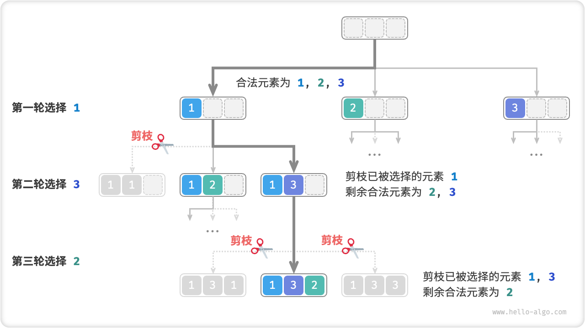
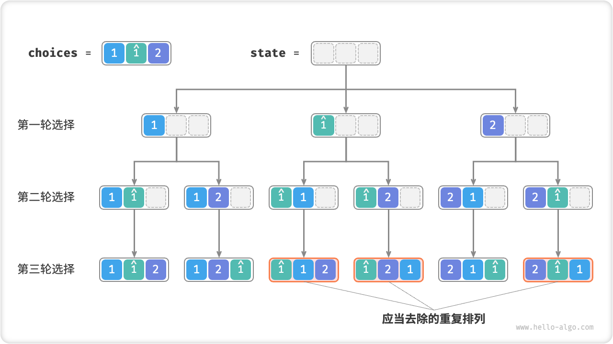
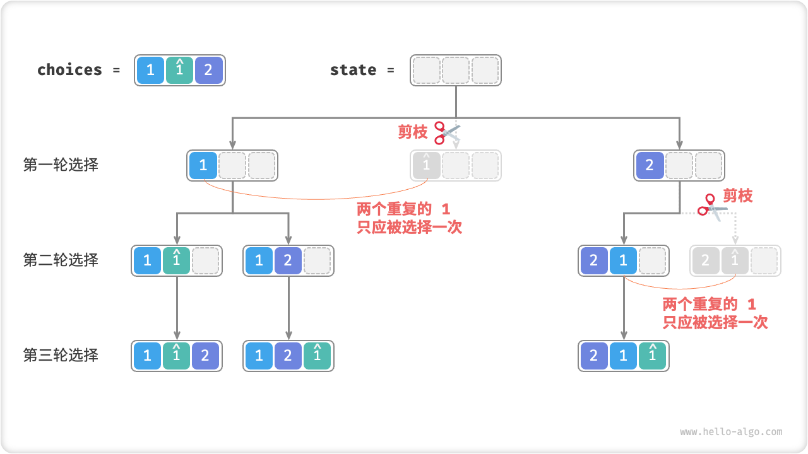
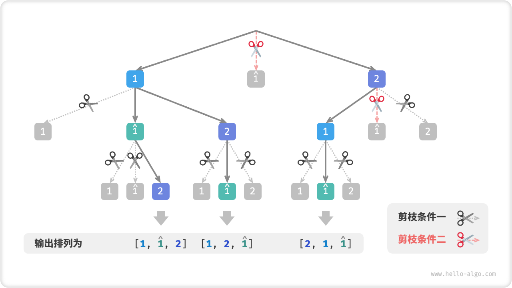

# 全排列问题

全排列问题是回溯算法的一个典型应用。它的定义是在给定一个集合（如一个数组或字符串）的情况下，找出这个集合中元素的所有可能的排列。

下表列举了几个示例数据，包括输入数组和对应的所有排列。

<div class="center-table" markdown>

| 输入数组    | 所有排列                                                           |
| :---------- | :----------------------------------------------------------------- |
| $[1]$       | $[1]$                                                              |
| $[1, 2]$    | $[1, 2], [2, 1]$                                                   |
| $[1, 2, 3]$ | $[1, 2, 3], [1, 3, 2], [2, 1, 3], [2, 3, 1], [3, 1, 2], [3, 2, 1]$ |

</div>

## 无相等元素的情况

!!! question

    输入一个整数数组，数组中不包含重复元素，返回所有可能的排列。

从回溯算法的角度看，**我们可以把生成排列的过程想象成一系列选择的结果**。假设输入数组为 $[1, 2, 3]$ ，如果我们先选择 $1$ 、再选择 $3$ 、最后选择 $2$ ，则获得排列 $[1, 3, 2]$ 。回退表示撤销一个选择，之后继续尝试其他选择。

从回溯代码的角度看，候选集合 `choices` 是输入数组中的所有元素，状态 `state` 是直至目前已被选择的元素。请注意，每个元素只允许被选择一次，**因此 `state` 中的所有元素都应该是唯一的**。

如下图所示，我们可以将搜索过程展开成一个递归树，树中的每个节点代表当前状态 `state` 。从根节点开始，经过三轮选择后到达叶节点，每个叶节点都对应一个排列。


### 重复选择剪枝

为了实现每个元素只被选择一次，我们考虑引入一个布尔型数组 `selected` ，其中 `selected[i]` 表示 `choices[i]` 是否已被选择。剪枝的实现原理为：

- 在做出选择 `choice[i]` 后，我们就将 `selected[i]` 赋值为 $\text{True}$ ，代表它已被选择。
- 遍历选择列表 `choices` 时，跳过所有已被选择过的节点，即剪枝。

如下图所示，假设我们第一轮选择 1 ，第二轮选择 3 ，第三轮选择 2 ，则需要在第二轮剪掉元素 1 的分支，在第三轮剪掉元素 1, 3 的分支。



观察上图发现，该剪枝操作将搜索空间大小从 $O(n^n)$ 降低至 $O(n!)$ 。

### 代码实现

想清楚以上信息之后，我们就可以在框架代码中做“完形填空”了。为了缩短代码行数，我们不单独实现框架代码中的各个函数，而是将他们展开在 `backtrack()` 函数中。

=== "Java"

    ```java title="permutations_i.java"
    [class]{permutations_i}-[func]{backtrack}

    [class]{permutations_i}-[func]{permutationsI}
    ```

=== "C++"

    ```cpp title="permutations_i.cpp"
    [class]{}-[func]{backtrack}

    [class]{}-[func]{permutationsI}
    ```

=== "Python"

    ```python title="permutations_i.py"
    [class]{}-[func]{backtrack}

    [class]{}-[func]{permutations_i}
    ```

=== "Go"

    ```go title="permutations_i.go"
    [class]{}-[func]{backtrackI}

    [class]{}-[func]{permutationsI}
    ```

=== "JS"

    ```javascript title="permutations_i.js"
    [class]{}-[func]{backtrack}

    [class]{}-[func]{permutationsI}
    ```

=== "TS"

    ```typescript title="permutations_i.ts"
    [class]{}-[func]{backtrack}

    [class]{}-[func]{permutationsI}
    ```

=== "C"

    ```c title="permutations_i.c"
    [class]{}-[func]{backtrack}

    [class]{}-[func]{permutationsI}
    ```

=== "C#"

    ```csharp title="permutations_i.cs"
    [class]{permutations_i}-[func]{backtrack}

    [class]{permutations_i}-[func]{permutationsI}
    ```

=== "Swift"

    ```swift title="permutations_i.swift"
    [class]{}-[func]{backtrack}

    [class]{}-[func]{permutationsI}
    ```

=== "Zig"

    ```zig title="permutations_i.zig"
    [class]{}-[func]{backtrack}

    [class]{}-[func]{permutationsI}
    ```

=== "Dart"

    ```dart title="permutations_i.dart"
    [class]{}-[func]{backtrack}

    [class]{}-[func]{permutationsI}
    ```

=== "Rust"

    ```rust title="permutations_i.rs"
    [class]{}-[func]{backtrack}

    [class]{}-[func]{permutations_i}
    ```

## 考虑相等元素的情况

!!! question

    输入一个整数数组，**数组中可能包含重复元素**，返回所有不重复的排列。

假设输入数组为 $[1, 1, 2]$ 。为了方便区分两个重复元素 $1$ ，我们将第二个 $1$ 记为 $\hat{1}$ 。

如下图所示，上述方法生成的排列有一半都是重复的。



那么如何去除重复的排列呢？最直接地，考虑借助一个哈希表，直接对排列结果进行去重。然而这样做不够优雅，**因为生成重复排列的搜索分支是没有必要的，应当被提前识别并剪枝**，这样可以进一步提升算法效率。

### 相等元素剪枝

观察发现，在第一轮中，选择 $1$ 或选择 $\hat{1}$ 是等价的，在这两个选择之下生成的所有排列都是重复的。因此应该把 $\hat{1}$ 剪枝掉。

同理，在第一轮选择 $2$ 后，第二轮选择中的 $1$ 和 $\hat{1}$ 也会产生重复分支，因此也应将第二轮的 $\hat{1}$ 剪枝。

本质上看，**我们的目标是在某一轮选择中，保证多个相等的元素仅被选择一次**。



### 代码实现

在上一题的代码的基础上，我们考虑在每一轮选择中开启一个哈希表 `duplicated` ，用于记录该轮中已经尝试过的元素，并将重复元素剪枝。

=== "Java"

    ```java title="permutations_ii.java"
    [class]{permutations_ii}-[func]{backtrack}

    [class]{permutations_ii}-[func]{permutationsII}
    ```

=== "C++"

    ```cpp title="permutations_ii.cpp"
    [class]{}-[func]{backtrack}

    [class]{}-[func]{permutationsII}
    ```

=== "Python"

    ```python title="permutations_ii.py"
    [class]{}-[func]{backtrack}

    [class]{}-[func]{permutations_ii}
    ```

=== "Go"

    ```go title="permutations_ii.go"
    [class]{}-[func]{backtrackII}

    [class]{}-[func]{permutationsII}
    ```

=== "JS"

    ```javascript title="permutations_ii.js"
    [class]{}-[func]{backtrack}

    [class]{}-[func]{permutationsII}
    ```

=== "TS"

    ```typescript title="permutations_ii.ts"
    [class]{}-[func]{backtrack}

    [class]{}-[func]{permutationsII}
    ```

=== "C"

    ```c title="permutations_ii.c"
    [class]{}-[func]{backtrack}

    [class]{}-[func]{permutationsII}
    ```

=== "C#"

    ```csharp title="permutations_ii.cs"
    [class]{permutations_ii}-[func]{backtrack}

    [class]{permutations_ii}-[func]{permutationsII}
    ```

=== "Swift"

    ```swift title="permutations_ii.swift"
    [class]{}-[func]{backtrack}

    [class]{}-[func]{permutationsII}
    ```

=== "Zig"

    ```zig title="permutations_ii.zig"
    [class]{}-[func]{backtrack}

    [class]{}-[func]{permutationsII}
    ```

=== "Dart"

    ```dart title="permutations_ii.dart"
    [class]{}-[func]{backtrack}

    [class]{}-[func]{permutationsII}
    ```

=== "Rust"

    ```rust title="permutations_ii.rs"
    [class]{}-[func]{backtrack}

    [class]{}-[func]{permutations_ii}
    ```

假设元素两两之间互不相同，则 $n$ 个元素共有 $n!$  种排列（阶乘）；在记录结果时，需要复制长度为 $n$ 的列表，使用 $O(n)$ 时间。因此，**时间复杂度为 $O(n!n)$** 。

最大递归深度为 $n$ ，使用 $O(n)$ 栈帧空间。`selected` 使用 $O(n)$ 空间。同一时刻最多共有 $n$ 个 `duplicated` ，使用 $O(n^2)$ 空间。**因此空间复杂度为 $O(n^2)$** 。

### 两种剪枝对比

请注意，虽然 `selected` 和 `duplicated` 都用作剪枝，但两者的目标不同：

- **重复选择剪枝**：整个搜索过程中只有一个 `selected` 。它记录的是当前状态中包含哪些元素，作用是避免某个元素在 `state` 中重复出现。
- **相等元素剪枝**：每轮选择（即每个开启的 `backtrack` 函数）都包含一个 `duplicated` 。它记录的是在遍历中哪些元素已被选择过，作用是保证相等元素只被选择一次。

下图展示了两个剪枝条件的生效范围。注意，树中的每个节点代表一个选择，从根节点到叶节点的路径上的各个节点构成一个排列。


