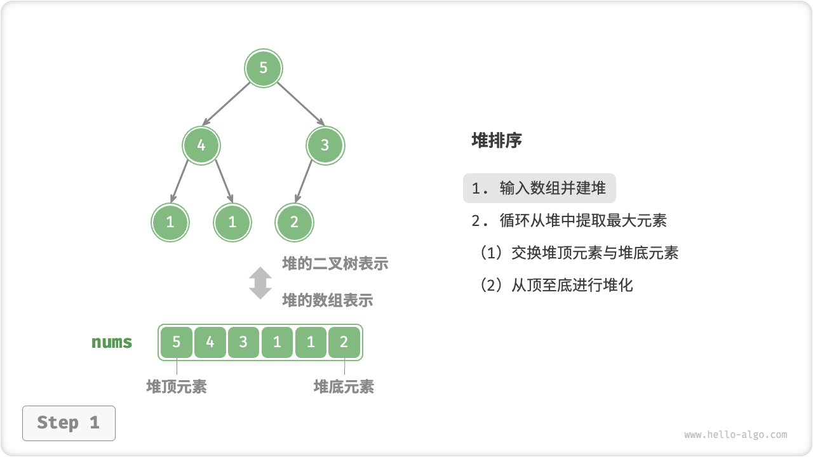
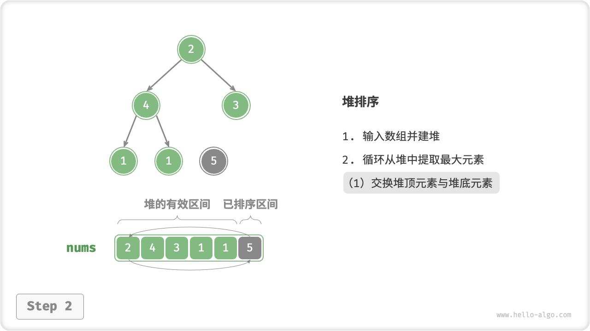
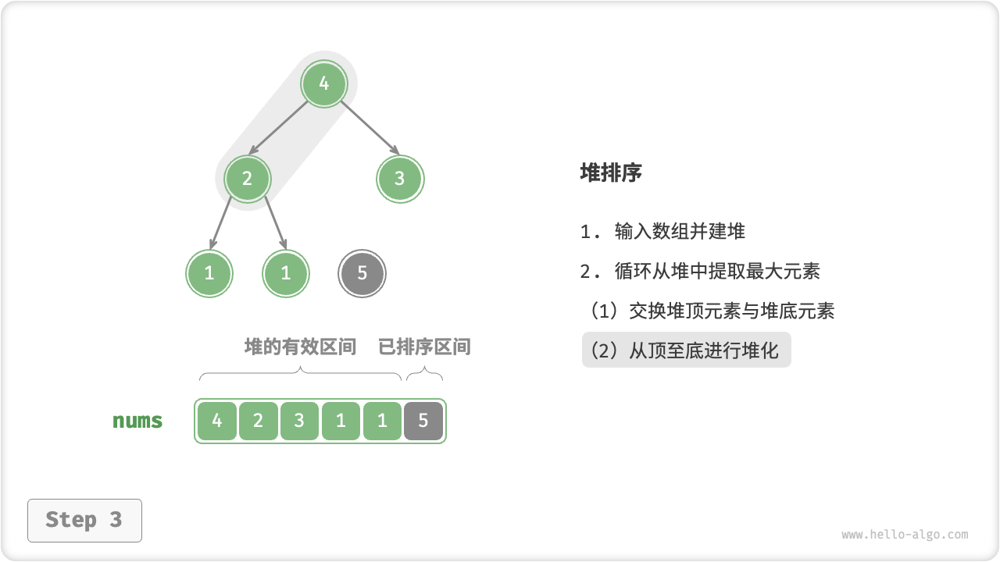
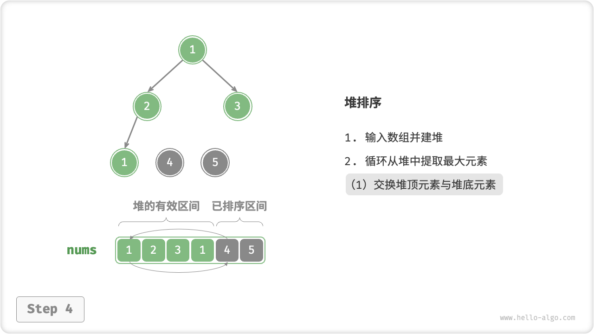
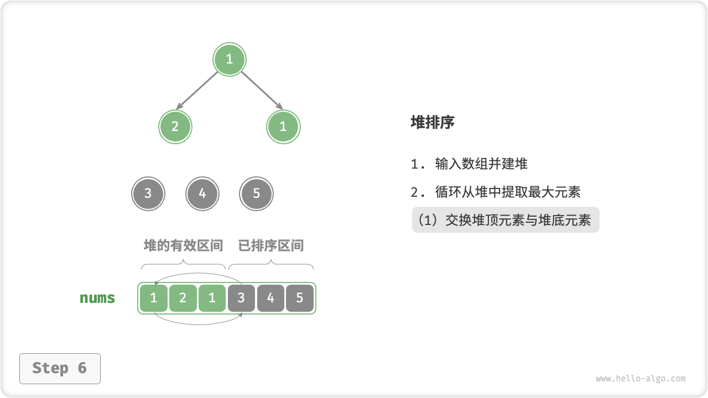
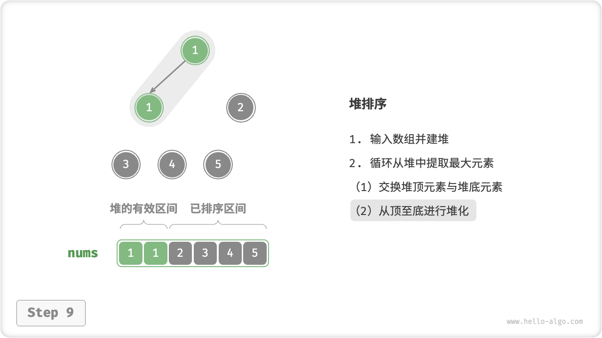
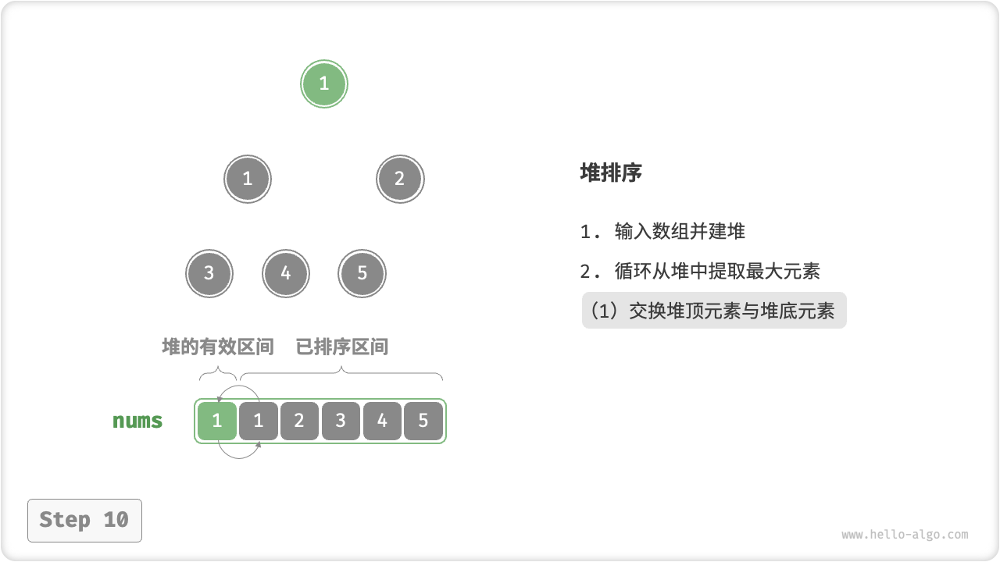
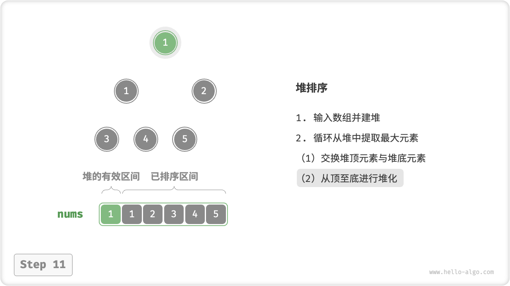

# 堆排序

!!! tip

    阅读本节前，请确保已学完「堆」章节。

「堆排序 Heap Sort」是一种基于堆数据结构实现的高效排序算法。我们可以利用已经学过的“建堆操作”和“元素出堆操作”实现堆排序：

1. 输入数组并建立小顶堆，此时最小元素位于堆顶。
2. 不断执行出堆操作，依次记录出堆元素，即可得到从小到大排序的序列。

以上方法虽然可行，但需要借助一个额外数组来保存弹出的元素，比较浪费空间。在实际中，我们通常使用一种更加优雅的实现方式。

## 算法流程

设数组的长度为 $n$ ，堆排序的流程如下：

1. 输入数组并建立大顶堆。完成后，最大元素位于堆顶。
2. 将堆顶元素（第一个元素）与堆底元素（最后一个元素）交换。完成交换后，堆的长度减 $1$ ，已排序元素数量加 $1$ 。
3. 从堆顶元素开始，从顶到底执行堆化操作（Sift Down）。完成堆化后，堆的性质得到修复。
4. 循环执行第 `2.` 和 `3.` 步。循环 $n - 1$ 轮后，即可完成数组排序。

实际上，元素出堆操作中也包含第 `2.` 和 `3.` 步，只是多了一个弹出元素的步骤。

=== "<1>"
    

=== "<2>"
    

=== "<3>"
    

=== "<4>"
    

=== "<5>"
    

=== "<6>"
    

=== "<7>"
    

=== "<8>"
    

=== "<9>"
    

=== "<10>"
    

=== "<11>"
    

=== "<12>"
    

在代码实现中，我们使用了与堆章节相同的从顶至底堆化（Sift Down）的函数。值得注意的是，由于堆的长度会随着提取最大元素而减小，因此我们需要给 Sift Down 函数添加一个长度参数 $n$ ，用于指定堆的当前有效长度。

=== "Java"

    ```java title="heap_sort.java"
    [class]{heap_sort}-[func]{siftDown}

    [class]{heap_sort}-[func]{heapSort}
    ```

=== "C++"

    ```cpp title="heap_sort.cpp"
    [class]{}-[func]{siftDown}

    [class]{}-[func]{heapSort}
    ```

=== "Python"

    ```python title="heap_sort.py"
    [class]{}-[func]{sift_down}

    [class]{}-[func]{heap_sort}
    ```

=== "Go"

    ```go title="heap_sort.go"
    [class]{}-[func]{siftDown}

    [class]{}-[func]{heapSort}
    ```

=== "JS"

    ```javascript title="heap_sort.js"
    [class]{}-[func]{siftDown}

    [class]{}-[func]{heapSort}
    ```

=== "TS"

    ```typescript title="heap_sort.ts"
    [class]{}-[func]{siftDown}

    [class]{}-[func]{heapSort}
    ```

=== "C"

    ```c title="heap_sort.c"
    [class]{}-[func]{siftDown}

    [class]{}-[func]{heapSort}
    ```

=== "C#"

    ```csharp title="heap_sort.cs"
    [class]{heap_sort}-[func]{siftDown}

    [class]{heap_sort}-[func]{heapSort}
    ```

=== "Swift"

    ```swift title="heap_sort.swift"
    [class]{}-[func]{siftDown}

    [class]{}-[func]{heapSort}
    ```

=== "Zig"

    ```zig title="heap_sort.zig"
    [class]{}-[func]{siftDown}

    [class]{}-[func]{heapSort}
    ```

=== "Dart"

    ```dart title="heap_sort.dart"
    [class]{}-[func]{siftDown}

    [class]{}-[func]{heapSort}
    ```

=== "Rust"

    ```rust title="heap_sort.rs"
    [class]{}-[func]{sift_down}

    [class]{}-[func]{heap_sort}
    ```

## 算法特性

- **时间复杂度 $O(n \log n)$ 、非自适应排序** ：建堆操作使用 $O(n)$ 时间。从堆中提取最大元素的时间复杂度为 $O(\log n)$ ，共循环 $n - 1$ 轮。
- **空间复杂度 $O(1)$ 、原地排序** ：几个指针变量使用 $O(1)$ 空间。元素交换和堆化操作都是在原数组上进行的。
- **非稳定排序**：在交换堆顶元素和堆底元素时，相等元素的相对位置可能发生变化。
