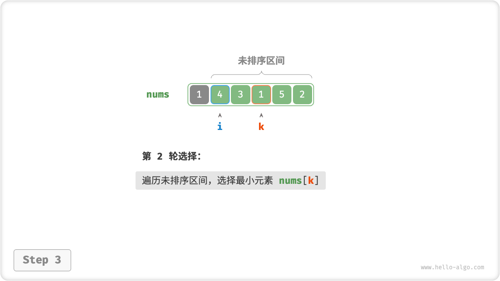
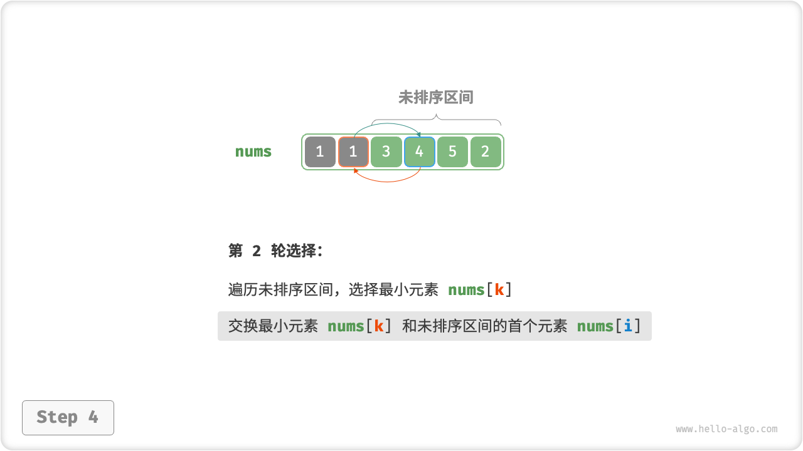
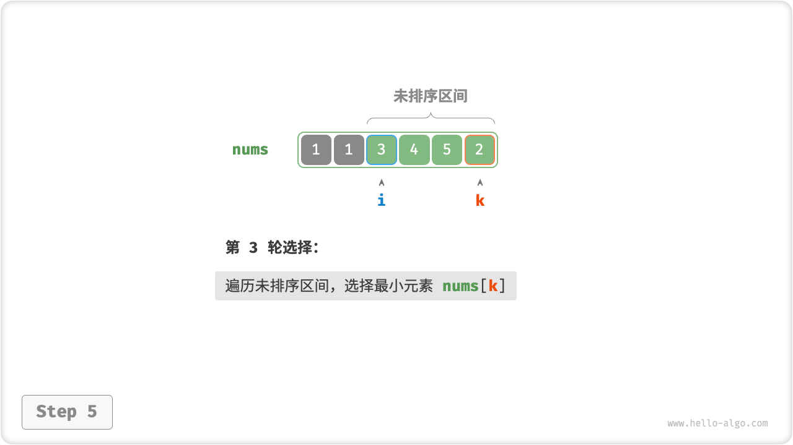
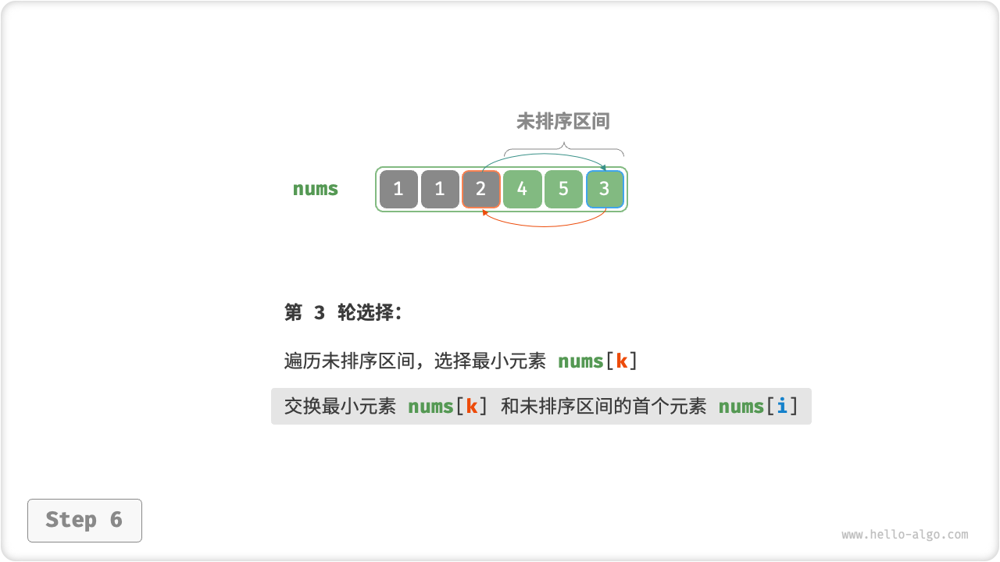
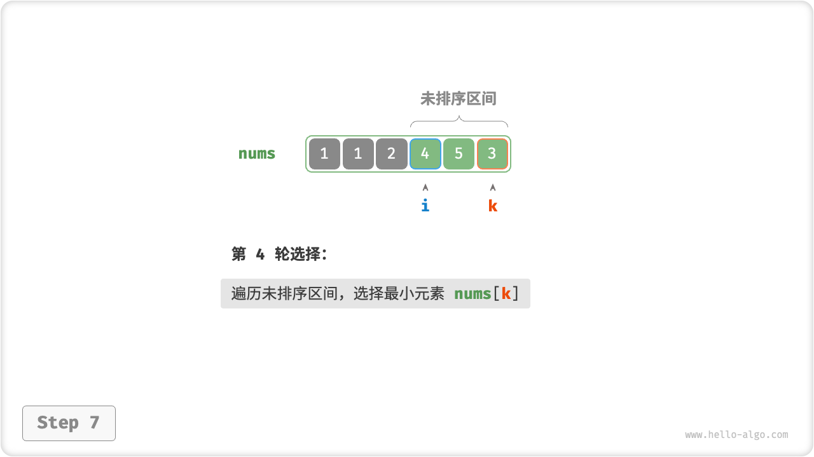
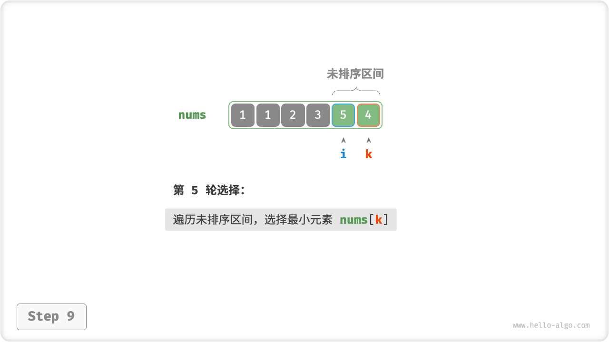
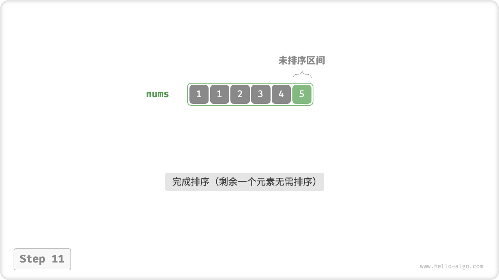
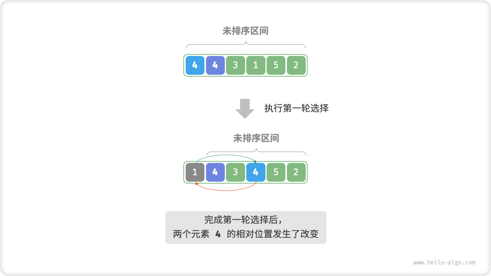

# 选择排序

「选择排序 Selection Sort」的工作原理非常直接：开启一个循环，每轮从未排序区间选择最小的元素，将其放到已排序区间的末尾。

设数组的长度为 $n$ ，选择排序的算法流程如下：

1. 初始状态下，所有元素未排序，即未排序（索引）区间为 $[0, n-1]$ 。
2. 选取区间 $[0, n-1]$ 中的最小元素，将其与索引 $0$ 处元素交换。完成后，数组前 1 个元素已排序。
3. 选取区间 $[1, n-1]$ 中的最小元素，将其与索引 $1$ 处元素交换。完成后，数组前 2 个元素已排序。
4. 以此类推。经过 $n - 1$ 轮选择与交换后，数组前 $n - 1$ 个元素已排序。
5. 仅剩的一个元素必定是最大元素，无需排序，因此数组排序完成。

=== "<1>"
    

=== "<2>"
    

=== "<3>"
    

=== "<4>"
    

=== "<5>"
    

=== "<6>"
    

=== "<7>"
    

=== "<8>"
    

=== "<9>"
    

=== "<10>"
    

=== "<11>"
    

在代码中，我们用 $k$ 来记录未排序区间内的最小元素。

=== "Java"

    ```java title="selection_sort.java"
    [class]{selection_sort}-[func]{selectionSort}
    ```

=== "C++"

    ```cpp title="selection_sort.cpp"
    [class]{}-[func]{selectionSort}
    ```

=== "Python"

    ```python title="selection_sort.py"
    [class]{}-[func]{selection_sort}
    ```

=== "Go"

    ```go title="selection_sort.go"
    [class]{}-[func]{selectionSort}
    ```

=== "JS"

    ```javascript title="selection_sort.js"
    [class]{}-[func]{selectionSort}
    ```

=== "TS"

    ```typescript title="selection_sort.ts"
    [class]{}-[func]{selectionSort}
    ```

=== "C"

    ```c title="selection_sort.c"
    [class]{}-[func]{selectionSort}
    ```

=== "C#"

    ```csharp title="selection_sort.cs"
    [class]{selection_sort}-[func]{selectionSort}
    ```

=== "Swift"

    ```swift title="selection_sort.swift"
    [class]{}-[func]{selectionSort}
    ```

=== "Zig"

    ```zig title="selection_sort.zig"
    [class]{}-[func]{selectionSort}
    ```

=== "Dart"

    ```dart title="selection_sort.dart"
    [class]{}-[func]{selectionSort}
    ```

=== "Rust"

    ```rust title="selection_sort.rs"
    [class]{}-[func]{selection_sort}
    ```

## 算法特性

- **时间复杂度为 $O(n^2)$ 、非自适应排序**：外循环共 $n - 1$ 轮，第一轮的未排序区间长度为 $n$ ，最后一轮的未排序区间长度为 $2$ ，即各轮外循环分别包含 $n$ , $n - 1$ , $\cdots$ , $2$ 轮内循环，求和为 $\frac{(n - 1)(n + 2)}{2}$ 。
- **空间复杂度 $O(1)$ 、原地排序**：指针 $i$ , $j$ 使用常数大小的额外空间。
- **非稳定排序**：在交换元素时，有可能将 `nums[i]` 交换至其相等元素的右边，导致两者的相对顺序发生改变。


